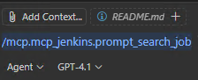
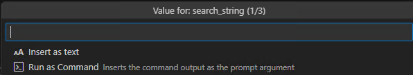

# mcp-jenkins

## 專案簡介

`mcp_jenkins` 是一個 Model Context Protocol (MCP) 伺服器，為使用 FastMCP 框架開發的 Jenkins 工具，支援 Jenkins Job、View、Build 等多種操作。

## 開發工具

| 工具名稱 | 版本 |
| -------- | ---- |
| IDE | Visual Studio Code |
| Python 版本 | 3.10 以上 |
| 套件管理工具 | `uv` |
| 風格檢查工具 | `ruff` |

## 環境安裝

1. 安裝 uv 套件管理工具。
    - 透過 Scoop 安裝：
        ```powershell
        Set-ExecutionPolicy -ExecutionPolicy RemoteSigned -Scope CurrentUser    # 允許執行安裝與管理腳本
        Invoke-RestMethod -Uri https://get.scoop.sh | Invoke-Expression
        ```
        ```sh
        scoop update
        scoop install uv
        ```
    - 透過 pip 安裝：
        ```sh
        pip install uv
        ```
2. 建立虛擬環境。
   ```sh
   uv venv
   ```
3. 依 `pyproject.toml` 安裝 Python 套件至 `.venv`。
   ```sh
   uv sync
   ```
4. 顯示已安裝的 Python 套件。
    ```sh
    uv tree -d 1
    ```

## MCP 設定檔

- 使用 `stdio` 模式啟動 MCP 伺服器。
    - 建立設定檔 `mcp.json`，範例如下：
        - 注意 `your_project_directory` 以絕對路徑表示，且在 `Windows` 上的路徑的反斜線 `\`，需要要轉換為雙反斜線 `\\`。
        ```json
        {
            "servers": {
                "mcp_jenkins": {
                    "type": "stdio",
                    "command": "uv",
                    "args": [
                        "--directory",
                        "your_project_directory",
                        "run",
                        "server_stdio.py"
                    ]
                }
            }
        }
        ```

## dot env 設定檔

- 建立 `.env` 檔案，可使用檔案 `.env_example`，並設定 Jenkins 相關參數，範例如下：
    ```
    JENKINS_BASE_URL=http://your_jenkins_url:port
    JENKINS_USERNAME=your_jenkins_username
    JENKINS_PASSWORD_OR_TOKEN=your_jenkins_password_or_api_token
    ```

## MCP Tool 說明

### Job

- `is_job_exists(job_name)`
    - 檢查 Job 是否存在。
- `is_job_queued_or_running(job_name)`
    - 檢查 Job 是否在佇列或執行中。
- `get_job_default_params(job_name)`
    - 取得 Job 預設參數。
- `get_job_baseurl(job_name)`
    - 取得 Job Base URL。
- `search_job(search_string, view_name=None, is_case_sensitive=True)`
    - 搜尋 Job。
- `create_job(job_name, config_xml=None)`
    - 建立新 Job。
- `clone_job(job_name, new_job_name)`
    - 複製 Job。
- `rename_job(job_name, new_job_name)`
    - 重新命名 Job。
- `delete_job(job_name)`
    - 刪除 Job。
- `build_job(job_name, params=None)`
    - 觸發 Job Build。

### View

- `get_views()`
    - 取得所有 Jenkins View。
- `get_jobs_from_view(view_name)`
    - 取得 View 內所有 Job。
- `get_view_baseurl(view_name)`
    - 取得 View Base URL。
- `add_job_to_view(view_name, job_name)`
    - 將 Job 加入 View。
- `remove_job_from_view(view_name, job_name)`
    - 將 Job 從 View 移除。

### Build

- `stop_last_build(job_name)`
    - 停止最後一個 Build。
- `get_last_build_number(job_name)`
    - 取得最後一個 Build 編號。
- `get_build_information(job_name, build_number=None)`
    - 取得 Build 詳細資訊。
- `get_build_params(job_name, build_number=None)`
    - 取得 Build 參數。
- `get_build_console(job_name, build_number=None)`
    - 取得 Build Console 輸出。

## MCP Prompts 說明

可以藉由 `/` 來快速呼叫以下的範例 Prompts，並在 VS Code 的上方輸入參數值。




---

### Job

- `prompt_get_job_default_params`
    - 取得 Job 預設參數。
- `prompt_get_job_baseurl`
    - 取得 Job Base URL。
- `prompt_search_job`
    - 搜尋 Job。
- `prompt_clone_job`
    - 複製 Job。
- `prompt_rename_job`
    - 重新命名 Job。
- `prompt_delete_job`
    - 刪除 Job。
- `prompt_build_job`
    - 觸發 Job Build。

### View

- `prompt_get_views`
    - 取得所有 View。
- `prompt_get_view_baseurl`
    - 取得 View Base URL。
- `prompt_add_job_to_view`
    - 將 Job 加入 View。
- `prompt_remove_job_from_view`
    - 將 Job 從 View 移除。

### Build

- `prompt_stop_last_build`
    - 停止最後一個 Build。
- `prompt_get_last_build_info`
    - 取得最後一個 Build 資訊。
